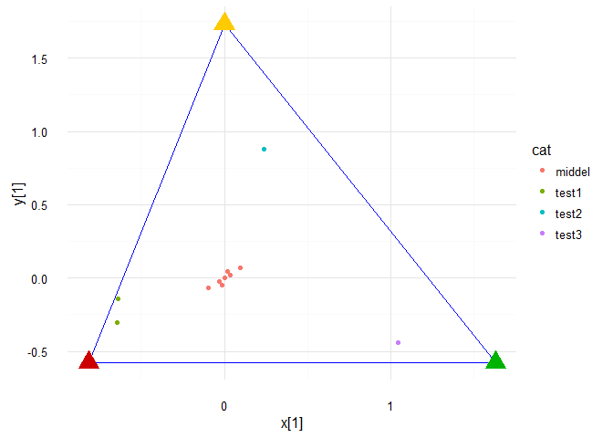

---
output:
  md_document:
    variant: markdown_github
---

<!-- README.md is generated from README.Rmd. Please edit that file -->

```{r, echo = FALSE}
knitr::opts_chunk$set(
  collapse = TRUE,
  comment = "#>",
  fig.path = "README-"
)
```
last change `r Sys.Date()`

Buildstatus: [](https://travis-ci.org/RMHogervorst/heisertransform)

[](http://www.repostatus.org/#active)


# Introduction - Quick start
An implementation of heiser (2004) that helps to visually display
relative probabilities to categorical assignment. Vertices,
representing the relative frequency of the categories, form the corners
of a triangle. Individual points in the triangle have a relative
position based on strength of association towards the vertices
(category). Thus points closer to a vertice have a larger probability
towards that category. 

This triangle approach is distinct from other
triangle plots known as terniary plots, trilinear diagrams or
triplots where every side of the triangle displays a dimension,
effectively creating a triangular coordinate system.
In our approach the relative probabilities are transformed to an
euclidian 2-dimensional space, making direct distance comparisons
possible. 

This package creates the vertices and coordinates for three
categorical probabilities that can be plotted with the plotting system
of your choice. For background information, the method and higher
dimensional generalizations: Geometric representation of association
between categories, 2004 , Psychometrika VOL. 69, NO. 4, 513-545.


This package helps in visualizing probability information for 3 predicted classes.
For instance with multinomial regression. 
It visualizes probability information from 3 classes into a 2 dimensional space.


# Use case:
You have created probabilties for three groups and would like to visualize this
information into one display. example:

```{r create testset, echo=FALSE}
#new testset
n <-25
var1 <- rnorm(n, mean = .60, sd = .14)
var2<- rnorm(n, .10, 0.15)
delete<-var1+var2 >1
var1<-var1[!delete]
var2<-var2[!delete]
var3<- 1-(var1+var2)
example_data <- data.frame(var1, var2, var3)

example_data <-rbind( example_data , setNames( rev(example_data) , names( example_data ) ) )
# van een paar punten 3 en 2 omwisselen
replaceindex <-example_data$var1 %in% sample(example_data$var1, 20, replace = FALSE)
example_data$var4[replaceindex]<- example_data$var2[replaceindex]
example_data$var4[!replaceindex]<- example_data$var3[!replaceindex]
example_data$var5[!replaceindex]<- example_data$var2[!replaceindex]
example_data$var5[replaceindex]<- example_data$var3[replaceindex]
example_data$var2 <-NULL
example_data$var3 <-NULL
names(example_data) <- c("prob1", "prob2", "prob3")
#example_data[rowSums(example_data <0)]
deleterow <- c(
        as.numeric(row.names(example_data[example_data$prob2<0,])),
        as.numeric(row.names(example_data[example_data$prob3<0,]))     
)
example_data <-example_data[-deleterow,]

print(example_data)
```

example in one plot

```{r display of variables}
library(heisertransform)
coordinates <- Prob2Coord(example_data, "prob1", "prob2", "prob3")
library(ggplot2)
ggplot(data = coordinates, aes(x,y)) + geom_point() + 
        geom_point(data = CreateVertices(example_data, "prob1", "prob2", "prob3"), 
                   aes(x, y) , color = "red", pch = 17, size = 5)
        
```




## To install
In the future this package will be on CRAN. 
To install this r-package make sure you have installed devtools, and install 
using github

See example:

```{r example loading, eval=FALSE}
#example
library(devtools)
install_github("rmhogervorst/heisertransform")
```


## Usage
Make sure your dataset has both the predictors and predicted classes. 
The probabilities for every case need to add up to 1. 

```{r example using, eval=FALSE}
library(heisertransform)
#create vertices (corners of the triangle)
vert<-CreateVertices(df = Dataframe, var_left = "Var1", var_top = "Var2",var_right = "Var3", verticeName = T)
#Add transformed X,Y coordinates to existing dataframe
NewDataframe<-Prob2Coord(df = Dataframe, var_left = "Var1", var_top = "Var2",var_right = "Var3", append = T)

```

# Background 
Theory


## Visual display in base plot
```{r}
library(heisertransform)
temp<-CreateVertices(testdata, "test1", "test2","test3",verticeName = FALSE)
plot(temp, main = "Endresult of heisertransform", pch = 17, col = "red")
points(Prob2Coord(testdata, "test1", "test2","test3"), col= "darkgreen", pch = 19)
segments(x0 = temp[1,1], y0 = temp[1,2], x1 =temp[2,1], y1 = temp[2,2])
segments(x0 = temp[2,1], y0 = temp[2,2], x1 =temp[3,1], y1 = temp[3,2])
segments(x0 = temp[3,1], y0 = temp[3,2], x1 =temp[1,1], y1 = temp[1,2])
```

## Advanced visual display in ggplot2
We've added a theme that you can use in ggplot (it empties the entire area)
And we've made some examples of lines, points and text.
This can be useful when you rebuild your plots with several predictors.

ggplot elements are lists. So you can create lists that will be applied to your plot.

```{r example lines points texts}
# plot with ggplot
library(ggplot2)
lines<- function(vert, x, y, line_colour){
        return(list(geom_segment(data = vert, aes(x = x[1], xend = x[3], y= y[1], yend= y[3]), colour = line_colour ),
     geom_segment(data = vert, aes(x = x[1], xend = x[2], y= y[1], yend= y[2]), colour = line_colour ), #left to up
     geom_segment(data = vert, aes(x = x[2], xend = x[3], y= y[2], yend= y[3]), colour = line_colour )) )#right to up
}

corners<-function(vert, x, y, colour_left = "#cc0000", colour_top = "#ffca00", colour_right = "#00b300", shape = 17, size = 5, stroke = 2){
        return(list(
                geom_point(data = vert[1,], aes(x, y),  shape = shape,  size = size, stroke = stroke, colour = colour_left),
             geom_point(data = vert[2,], aes(x, y),  shape = shape,  size = size, stroke = stroke, colour = colour_top),
             geom_point(data = vert[3,], aes(x, y),  shape = shape,  size = size, stroke = stroke, colour = colour_right)
))}


points<-Prob2Coord(testdata, "test1", "test2","test3", append = T)
g<-ggplot() +lines(temp, x, y,"blue" )+ corners(temp, x, y, size = 5) + geom_point(data =points, aes(x,y, colour = cat)) + theme_minimal()
#makes blue lines, standard colours of the vertices.
print(g)
```

