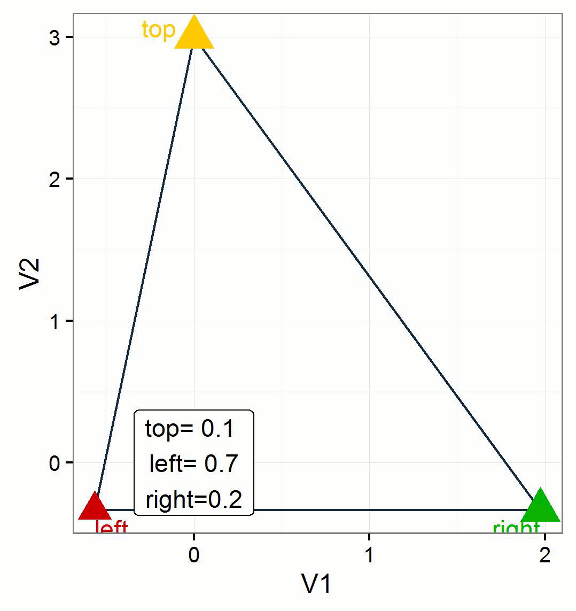

---
output:
  md_document:
    variant: markdown_github
---

<!-- README.md is generated from README.Rmd. Please edit that file -->

```{r, echo = FALSE}
knitr::opts_chunk$set(
  collapse = TRUE,
  comment = "#>",
  fig.path = "README-"
)
```

last change `r Sys.Date()`

Buildstatus: [](https://travis-ci.org/RMHogervorst/heisertransform)
[](http://www.repostatus.org/#active)


# Introduction - Quick start
This package helps in visualizing probability information for 3 predicted classes.
For instance with multinomial regression. 
It visualizes probability information from 3 classes into a 2 dimensional space.
[example]

# Use case:
You have created probabilties for three groups from your multinomial, 
but visualizing this information is often difficult.

[table view of three probabilties]

[example in one plot]


## To install
In the future this package will be on CRAN. 
To install this r-package make sure you have installed devtools, and install 
using github

See example:

```{r example loading, eval=FALSE}
#example
library(devtools)
install_github("rmhogervorst/heisertransform")
```


## Usage
Make sure your dataset has both the predictors and predicted classes. 
The probabilities for every case need to add up to 1. 

```{r example using, eval=FALSE}
library(heisertransform)
#create vertices (corners of the triangle)
vert<-CreateVertices(df = Dataframe, var_left = "Var1", var_top = "Var2",var_right = "Var3", verticeName = T)
#Add transformed X,Y coordinates to existing dataframe
NewDataframe<-Prob2Coord(df = Dataframe, var_left = "Var1", var_top = "Var2",var_right = "Var3", append = T)

```

# Background 
Theory




## Visual display in base plot
```{r}
library(heisertransform)
temp<-CreateVertices(testdata, "test1", "test2","test3",verticeName = FALSE)
plot(temp, main = "Endresult of heisertransform", pch = 17, col = "red")
points(Prob2Coord(testdata, "test1", "test2","test3"), col= "darkgreen", pch = 19)
segments(x0 = temp[1,1], y0 = temp[1,2], x1 =temp[2,1], y1 = temp[2,2])
segments(x0 = temp[2,1], y0 = temp[2,2], x1 =temp[3,1], y1 = temp[3,2])
segments(x0 = temp[3,1], y0 = temp[3,2], x1 =temp[1,1], y1 = temp[1,2])
```

## Advanced visual display in ggplot2
We've added a theme that you can use in ggplot (it empties the entire area)
And we've made some examples of lines, points and text.
This can be useful when you rebuild your plots with several predictors.

ggplot elements are lists. So you can create lists that will be applied to your plot.

```{r example lines points texts}
# plot with ggplot
library(ggplot2)
lines<- function(vert, x, y, line_colour){
        return(list(geom_segment(data = vert, aes(x = x[1], xend = x[3], y= y[1], yend= y[3]), colour = line_colour ),
     geom_segment(data = vert, aes(x = x[1], xend = x[2], y= y[1], yend= y[2]), colour = line_colour ), #left to up
     geom_segment(data = vert, aes(x = x[2], xend = x[3], y= y[2], yend= y[3]), colour = line_colour )) )#right to up
}

corners<-function(vert, x, y, colour_left = "#cc0000", colour_top = "#ffca00", colour_right = "#00b300", shape = 17, size = 5, stroke = 2){
        return(list(
                geom_point(data = vert[1,], aes(x, y),  shape = shape,  size = size, stroke = stroke, colour = colour_left),
             geom_point(data = vert[2,], aes(x, y),  shape = shape,  size = size, stroke = stroke, colour = colour_top),
             geom_point(data = vert[3,], aes(x, y),  shape = shape,  size = size, stroke = stroke, colour = colour_right)
))}


points<-Prob2Coord(testdata, "test1", "test2","test3", append = T)
g<-ggplot() +lines(temp, x, y,"blue" )+ corners(temp, x, y, size = 5) + geom_point(data =points, aes(x,y, colour = cat)) + theme_minimal()
#makes blue lines, standard colours of the vertices.
print(g)
```

