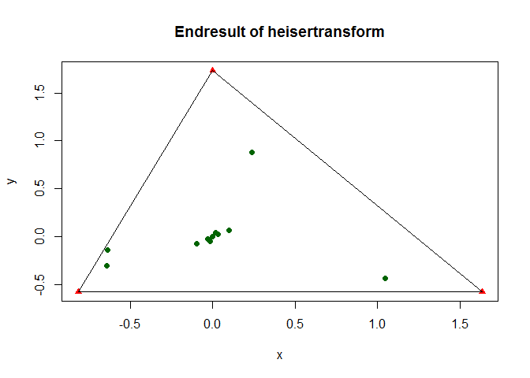

<!-- README.md is generated from README.Rmd. Please edit that file -->
last change 2016-05-13

Buildstatus: [](https://travis-ci.org/RMHogervorst/heisertransform)

[](http://www.repostatus.org/#active)

Introduction - Quick start
==========================

An implementation of heiser (2004) that helps to visually display relative probabilities to categorical assignment. Vertices, representing the relative frequency of the categories, form the corners of a triangle. Individual points in the triangle have a relative position based on strength of association towards the vertices (category). Thus points closer to a vertice have a larger probability towards that category.

This triangle approach is distinct from other triangle plots known as terniary plots, trilinear diagrams or triplots where every side of the triangle displays a dimension, effectively creating a triangular coordinate system. In our approach the relative probabilities are transformed to an euclidian 2-dimensional space, making direct distance comparisons possible.

This package creates the vertices and coordinates for three categorical probabilities that can be plotted with the plotting system of your choice. For background information, the method and higher dimensional generalizations: Geometric representation of association between categories, 2004 , Psychometrika VOL. 69, NO. 4, 513-545.

This package helps in visualizing probability information for 3 predicted classes. For instance with multinomial regression. It visualizes probability information from 3 classes into a 2 dimensional space.

Use case:
=========

You have created probabilties for three groups and would like to visualize this information into one display. example:

    #>         prob1      prob2      prob3
    #> 1  0.52753943 0.03222735 0.44023322
    #> 2  0.70082306 0.17195938 0.12721756
    #> 4  0.59351569 0.28379908 0.12268522
    #> 5  0.78965190 0.10203482 0.10831328
    #> 6  0.56354927 0.29118303 0.14526770
    #> 7  0.60514734 0.23006269 0.16478997
    #> 8  0.80239649 0.12093880 0.07666471
    #> 9  0.67548456 0.17830660 0.14620883
    #> 10 0.43182806 0.27749488 0.29067706
    #> 11 0.69911785 0.27725202 0.02363013
    #> 16 0.74510934 0.09826331 0.15662735
    #> 18 0.63513463 0.13456777 0.23029760
    #> 19 0.47967302 0.05995396 0.46037303
    #> 20 0.66562374 0.08668552 0.24769074
    #> 21 0.47398622 0.22016731 0.30584647
    #> 22 0.75363045 0.03685542 0.20951413
    #> 23 0.65161688 0.02795031 0.32043281
    #> 24 0.44023322 0.52753943 0.03222735
    #> 25 0.17195938 0.12721756 0.70082306
    #> 27 0.28379908 0.12268522 0.59351569
    #> 28 0.10831328 0.78965190 0.10203482
    #> 29 0.29118303 0.56354927 0.14526770
    #> 30 0.23006269 0.16478997 0.60514734
    #> 31 0.12093880 0.07666471 0.80239649
    #> 32 0.17830660 0.67548456 0.14620883
    #> 33 0.29067706 0.27749488 0.43182806
    #> 34 0.27725202 0.69911785 0.02363013
    #> 39 0.15662735 0.74510934 0.09826331
    #> 41 0.13456777 0.63513463 0.23029760
    #> 42 0.46037303 0.47967302 0.05995396
    #> 43 0.08668552 0.24769074 0.66562374
    #> 44 0.30584647 0.47398622 0.22016731
    #> 45 0.20951413 0.03685542 0.75363045
    #> 46 0.32043281 0.02795031 0.65161688

example in one plot

``` r
library(heisertransform)
coordinates <- Prob2Coord(example_data, "prob1", "prob2", "prob3")
library(ggplot2)
ggplot(data = coordinates, aes(x,y)) + geom_point() + 
        geom_point(data = CreateVertices(example_data, "prob1", "prob2", "prob3"), 
                   aes(x, y) , color = "red", pch = 17, size = 5)
```

<!-- -->


To install
----------

In the future this package will be on CRAN. To install this r-package make sure you have installed devtools, and install using github

See example:

``` r
#example
library(devtools)
install_github("rmhogervorst/heisertransform")
```

Usage
-----

Make sure your dataset has both the predictors and predicted classes. The probabilities for every case need to add up to 1.

``` r
library(heisertransform)
#create vertices (corners of the triangle)
vert<-CreateVertices(df = Dataframe, var_left = "Var1", var_top = "Var2",var_right = "Var3", verticeName = T)
#Add transformed X,Y coordinates to existing dataframe
NewDataframe<-Prob2Coord(df = Dataframe, var_left = "Var1", var_top = "Var2",var_right = "Var3", append = T)
```

Background
==========

Theory


Visual display in base plot
---------------------------

``` r
library(heisertransform)
temp<-CreateVertices(testdata, "test1", "test2","test3",verticeName = FALSE)
plot(temp, main = "Endresult of heisertransform", pch = 17, col = "red")
points(Prob2Coord(testdata, "test1", "test2","test3"), col= "darkgreen", pch = 19)
segments(x0 = temp[1,1], y0 = temp[1,2], x1 =temp[2,1], y1 = temp[2,2])
segments(x0 = temp[2,1], y0 = temp[2,2], x1 =temp[3,1], y1 = temp[3,2])
segments(x0 = temp[3,1], y0 = temp[3,2], x1 =temp[1,1], y1 = temp[1,2])
```

<!-- -->

Advanced visual display in ggplot2
----------------------------------

We've added a theme that you can use in ggplot (it empties the entire area) And we've made some examples of lines, points and text. This can be useful when you rebuild your plots with several predictors.

ggplot elements are lists. So you can create lists that will be applied to your plot.

``` r
# plot with ggplot
library(ggplot2)
lines<- function(vert, x, y, line_colour){
        return(list(geom_segment(data = vert, aes(x = x[1], xend = x[3], y= y[1], yend= y[3]), colour = line_colour ),
     geom_segment(data = vert, aes(x = x[1], xend = x[2], y= y[1], yend= y[2]), colour = line_colour ), #left to up
     geom_segment(data = vert, aes(x = x[2], xend = x[3], y= y[2], yend= y[3]), colour = line_colour )) )#right to up
}

corners<-function(vert, x, y, colour_left = "#cc0000", colour_top = "#ffca00", colour_right = "#00b300", shape = 17, size = 5, stroke = 2){
        return(list(
                geom_point(data = vert[1,], aes(x, y),  shape = shape,  size = size, stroke = stroke, colour = colour_left),
             geom_point(data = vert[2,], aes(x, y),  shape = shape,  size = size, stroke = stroke, colour = colour_top),
             geom_point(data = vert[3,], aes(x, y),  shape = shape,  size = size, stroke = stroke, colour = colour_right)
))}


points<-Prob2Coord(testdata, "test1", "test2","test3", append = T)
g<-ggplot() +lines(temp, x, y,"blue" )+ corners(temp, x, y, size = 5) + geom_point(data =points, aes(x,y, colour = cat)) + theme_minimal()
#makes blue lines, standard colours of the vertices.
print(g)
```

<!-- -->
